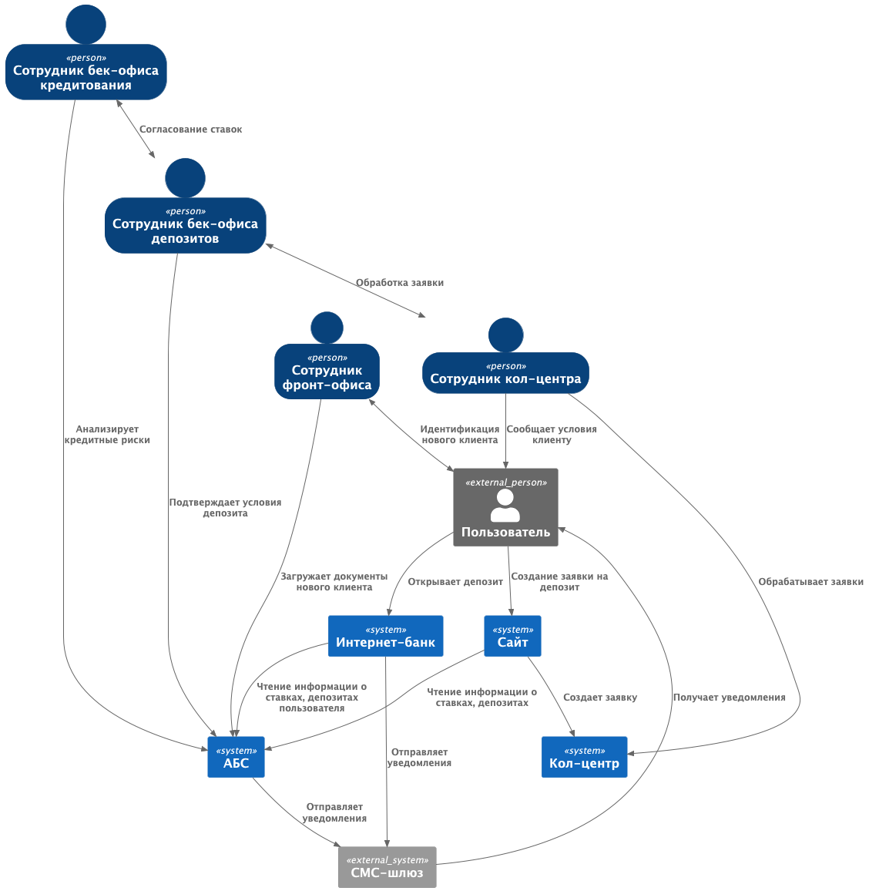
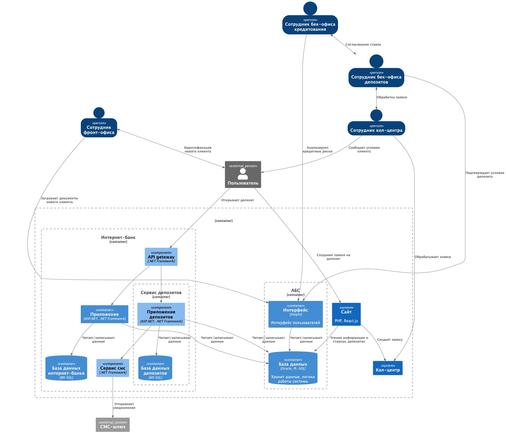

### **Название задачи:** Открытия депозитов онлайн

### **Автор:** Лаврёнова О.Н.

### **Дата:** 30.05.2025

### **Функциональные требования**

| **№** | **Действующие лица или системы**                         | **Use Case**                 | **Описание**                                                                                          |
|:-----:|:---------------------------------------------------------|:-----------------------------|:------------------------------------------------------------------------------------------------------|
|  UC1  | Пользователь, сайт                                       | Создание заявки на депозит   | 1. Пользователь открывает сайт                                                                        |
|       |                                                          |                              | 2. Просматривает список доступных депозитов и ставок                                                  |
|       |                                                          |                              | 3. Пользователь заполняет форму                                                                       |
|       |                                                          |                              | 4. При успешной отправке формы, пользователь видит сообщение, что после обработки заявки ему позвонят |
|       |                                                          |                              |                                                                                                       |
|  UC2  | Сотр. кол-центра, сотр. бек-офиса                        | Обработка заявки             | 1. Сотрудник кол-центра обрабатывает заявку и запрашивает особые условия                              |
|       |                                                          |                              | 2. Сотрудник бек-офиса согласует ставки                                                               |
|       |                                                          |                              | 3. Сотрудник бек-офиса передает ставки в кол-центр                                                    |
|       |                                                          |                              | 4. Сотрудник кол-центра сообщает специальные ставки клиенту                                           |
|       |                                                          |                              |                                                                                                       |
|  UC3  | Сотр. бек-офиса депозитов, сотр. бек-офиса кредитов, АБС | Согласование ставок          | 1. Сотрудник бек-офиса депозитов отправляет заявку на согласование ставок сотруднику кредитов         |
|       |                                                          |                              | 2. Сотрудник бек-офиса кредитов анализирует риски в АБС                                               |
|       |                                                          |                              | 3. Сотрудник бек-офиса кредитов отправляет решение сотруднику депозитов                               |
|       |                                                          |                              | 4. Пользователь информируется о персональных условиях                                                 |
|       |                                                          |                              |                                                                                                       |
|  UC4  | Пользователь, сотр. фронт-офиса, АБС                     | Идентификация нового клиента | 1. Пользователь проверяет документы в офисе                                                           |
|       |                                                          |                              | 2. Сотрудник фронт-офиса проверяет документы                                                          |
|       |                                                          |                              | 3. Сотрудник фронт-офиса загружает документы в АБС                                                    |
|       |                                                          |                              |                                                                                                       |
|  UC5  | Пользователь, интернет-банкб АБС                         | Открытие депозита            | 1. Пользователь заходит в интернет-банк                                                               |
|       |                                                          |                              | 2. Просматривает список доступных депозитов с актуальными ставками, персонализированными для него     |
|       |                                                          |                              | 3. Пользователь указывает счет и сумму депозита                                                       |
|       |                                                          |                              | 4. Отправляет заявку                                                                                  |
|       |                                                          |                              | 5. Система отправляет смс для подтверждения заявки                                                    |
|       |                                                          |                              | 6. Пользователь вводит код из смс                                                                     |
|       |                                                          |                              | 7. Сотрудник бек-офиса обрабатывает заявку на депозит                                                 |
|       |                                                          |                              | 8. Сотрудник бек-офиса депозитов подтверждает условия депозита в АБС                                  |
|       |                                                          |                              | 9. АБС отправляет смс-уведомление о подтверждении размера ставки и открытия депозита                  |

### **Нефункциональные требования**

| **№** | **Требование**                                                                                           |
|:-----:|:---------------------------------------------------------------------------------------------------------|
|   1   | Данные шифруются при передаче                                                                            |             
|   2   | Все сервисы должны работать 24/7 и быть доступны в 99,9% случаев                                         |             
|   3   | Отклик по всем операциям должен занимать миллисекунды                                                    |             
|   4   | Функционал работы с СМС нужно разработать внутри банка                                                   |             
|   5   | При доработках во всех системах нужно как можно больше использовать технологии, которые уже есть в банке |             
|   6   | Новые технологии должны быть совместимы с существующими платформами разработки                           |             
|   7   | В будущем необходимо уйти от прямой работы интернет-банка с API АБС                                      |             
|   8   | Базы банных: MS SQL, Oracle, PostgreSQL                                                                  |             
|   9   | Фронтенд: ASP.NET, React.js                                                                              |             
|  10   | Бэкенд: .NET Framework 4.5, Delphi, Java Spring Boot, PHP                                                |

### **Решение**

- Чтобы не зависеть от подрядчика, разрабатываться функционал будет внутри банка. 
- Для быстрой реализации системы принято решение использовать тот же стек технологий, потому что экспертиза по нему уже существует в команде.
- Выбрана микросервисная архитектура, чтобы в дальнейшем было проще масштабировать систему. 
- Для реализации нового функционала добавлены сервисы работы с депозитами и смс, а также API шлюз.
- Весь новый функционал изолирован, его проще тестировать и можно быстрее ввести в эксплуатацию

### **Альтернативы**

- Развитие интернет-банка можно переложить на подрядчика и заняться доработкой и оптимизацией работы АБС.
- Использовать очереди сообщений для коммуникации интернет-банка и АБС

**Недостатки, ограничения, риски**

- Решение не снимает нагрузки с АБС
- Все еще нет автоматизации в работе бек-офиса
- Возможно, понадобится нам новых разработчиков
