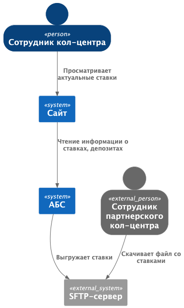
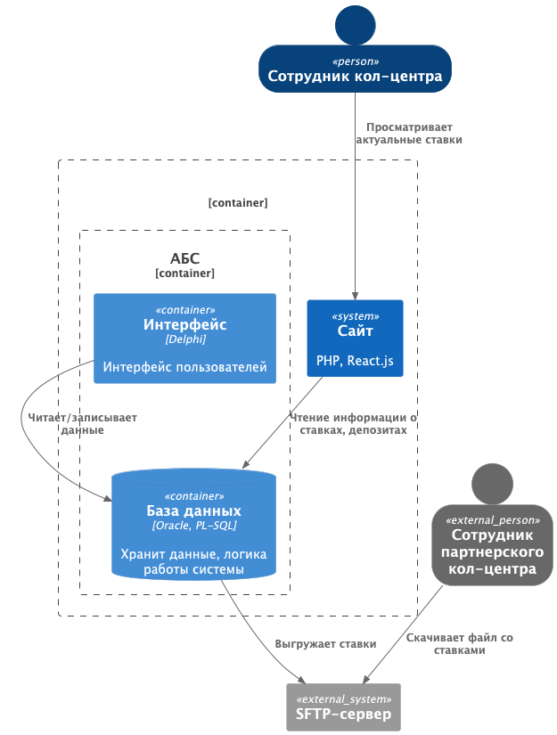
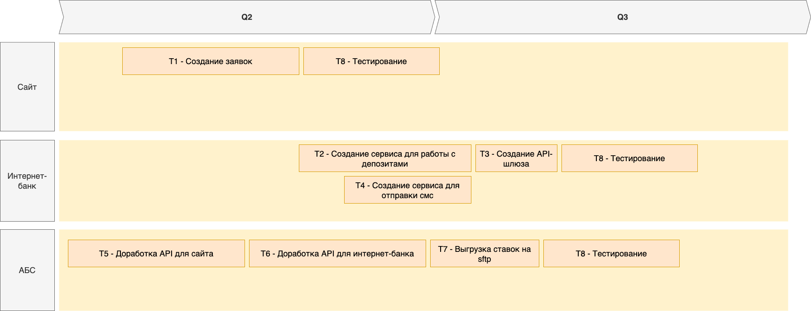

### **Название задачи:** Передача ставок в кол-центр

### **Автор:** Лаврёнова О.Н.

### **Дата:** 30.05.2025

### **Функциональные требования**

| **№** | **Действующие лица или системы**        | **Use Case**                              | **Описание**                                                                  |
|:-----:|:----------------------------------------|:------------------------------------------|:------------------------------------------------------------------------------|
|  UC1  | Сотр. кол-центра, сайт                  | Получение информации о ставках            | 1. Сотрудник  открывает сайт                                                  |
|       |                                         |                                           | 2. Просматривает список доступных ставок                                      |
|       |                                         |                                           |                                                                               |
| *UC2  | Сотр. кол-центра партнеров, SFTP-сервер | Получение информации о ставках через файл | 1. При обновлении ставок в АБС, система генерирует файл с актуальными данными |
|       |                                         |                                           | 2. АБС автоматически выгружает файл на SFTP-сервер                            |
|       |                                         |                                           | 3. Сотрудник кол-центра партнеров заходит на SFTP                             |
|       |                                         |                                           | 4. Сотрудник кол-центра партнеров скачивает файл                              |

### **Нефункциональные требования**

| **№** | **Требование**                                                   |
|:-----:|:-----------------------------------------------------------------|
|   1   | Данные шифруются при передаче                                    |             
|   2   | Все сервисы должны работать 24/7 и быть доступны в 99,9% случаев |             

### **Решение**

Текущие актуальные ставки уже отображаются на сайте.
Значит достаточно проинформировать сотрудников кол-центра банка и партнерского кол-центра, где на сайте отображается
необходимая информация.

### **Альтернативы**

Если по каким-то причинам партнерский кол-центр не может просматривать сайт, можно создать sftp-сервер
и дописать код, который при обновлении ставок в АБС, будет выгружать актуальные данные в файл и загружать на сервер

**Недостатки, ограничения, риски**

- Важно, чтобы информация своевременно обновлялась на сайте (на sftp-сервере), иначе клиент может получить устаревшие
  данные.
- Проблемы с сетью могут помешать актуализировать информацию

### Список задач

| **№** | **Задача**                               | Система                 |
|:-----:|:-----------------------------------------|-------------------------|
|  T1   | Создание заявок                          | Сайт                    |
|  T2   | Создание сервиса для работы с депозитами | Интернет-банк           |
|  T3   | Создание API-шлюза                       | Интернет-банк           |
|  T4   | Создание сервиса для отправки смс        | Интернет-банк           |
|  T5   | Доработка API для сайта                  | АБС                     |
|  T6   | Доработка API для интернет-банка         | АБС                     |
|  T7   | Выгрузка ставок на sftp                  | АБС                     |
|  T8   | Тестирование                             | Сайт, Интернет-банк,АБС |

